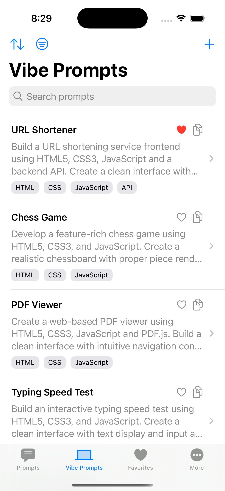
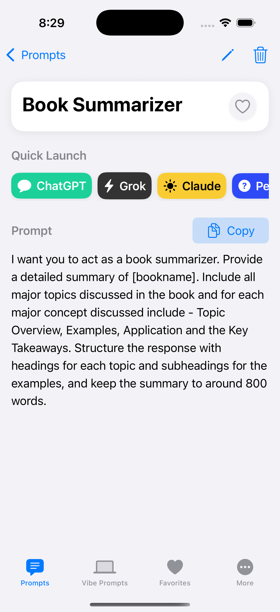
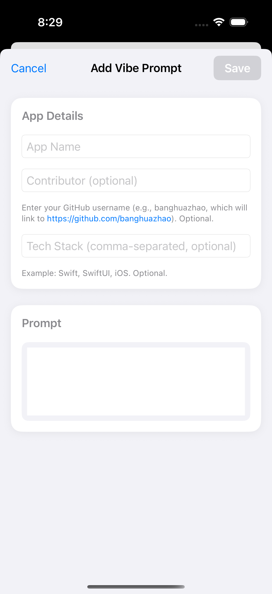

# AI Prompts ✨

A Swift iOS app for managing, browsing, and sharing AI prompts. Inspired by [f/awesome-chatgpt-prompts](https://github.com/f/awesome-chatgpt-prompts), this app offers a curated collection of prompts for ChatGPT, Grok, and other LLM tools. Now featuring prompt categories, context engineering tips, and a built-in prompt analyzer for enhanced prompt engineering.

## 📸 Screenshots

<p align="center">
  
  
  
</p>

## ✨ Features

- 📚 **Curated Prompts**: Browse a collection of high-quality AI prompts, including a special "Vibe Prompts" section for app-specific or mood-based prompts.
- ✨ **AI-Powered Prompt Generation (Offline)**: Instantly generate new, unique prompts using an on-device Markov chain model trained on the existing prompt corpus. Works for both Prompts and Vibe Prompts, with no internet required.
- ❤️ **Favorites**: Mark prompts as favorites for quick access.
- 🧩 **Fill-in-the-Blank Templates**: Prompts with variables (`{{topic}}`, `${Name: default}`, or a trailing `My first request is "..."`) get a **Customize & Use** sheet. Fill in the blanks, preview the result live, then copy it or launch it straight into ChatGPT, Claude, Gemini, Grok, or Perplexity.
- 🔍 **Prompt Details**: View detailed information for each prompt, including contributor and tech stack.
- 🖥️ **Modern SwiftUI Interface**: Clean, tab-based navigation for Prompts, Vibe Prompts, Favorites, and More.
- 🧩 **Modular Architecture**: Includes a reusable `MoreApps` module for app recommendations, with localization support.
- 💾 **Local Data Management**: Uses GRDB for efficient, local data storage and management.
- 🗂️ **Prompt Categories**: Organize and browse prompts by category for easier discovery and filtering. Quickly find prompts relevant to your needs.
- 🧠 **Context Engineering Tips**: Access best practices and actionable tips for effective context engineering directly in the app, helping you craft better prompts for LLMs.
- 🛠️ **Prompt Engineering Analyzer**: Analyze your prompts with built-in tools to improve their effectiveness, clarity, and results.
- 🌙 **Dark Mode**: Supports system-wide dark mode, with user preference override.
- 📢 **Ad Integration**: Integrates Google Mobile Ads with ATT permission handling.
- 🛒 **App Store Links**: The More tab features other recommended apps with direct App Store links.

## 🚀 Getting Started

### Prerequisites

- Xcode 14 or later
- Swift 5.7+
- iOS 17.0+

### Installation

1. Clone the repository:
   ```bash
   git clone https://github.com/banghuazhao/ai-prompts.git
   cd ai-prompts
   ```
2. Open `AIPrompts.xcodeproj` in Xcode.
3. Run the project on your simulator or device.

### 🗂️ Project Structure

- `AIPrompts/App/` – App entry point and main views (tab navigation)
- `AIPrompts/Components/` – SwiftUI components (Favorites, Prompts, VibePrompt, More, etc.)
- `AIPrompts/Model/` – Data models (`Prompt`, `VibePrompt`)
- `AIPrompts/Service/` – Data management, CSV loading, and app services
- `AIPrompts/Modules/MoreApps/` – Modular feature for app recommendations (with localization)
- `AIPrompts/Doc/` – CSV files for prompt data
- `AIPrompts/Assets.xcassets/` – App icons and assets

## 📝 Data Model Example

```swift
struct VibePrompt: Identifiable, Hashable {
    let id: Int
    var app: String
    var prompt: String
    var contributor: String
    var techstack: String
    var isFavorite: Bool
    // ...
}
```

## 🤝 Contributing

Contributions are welcome! Please open issues or pull requests for new prompts, features, or bug fixes. To add new prompts, simply update the CSV files in `AIPrompts/Doc/`.

## 📄 License

[MIT](LICENSE)

## 👤 Author

- [banghuazhao](https://github.com/banghuazhao)

## 💡 Inspiration

This project is inspired by [f/awesome-chatgpt-prompts](https://github.com/f/awesome-chatgpt-prompts), a curated collection of useful prompts for ChatGPT and other LLM tools. 

## ✨ AI-Powered Prompt Generation

The app features an **offline AI prompt generator** for both Prompts and Vibe Prompts:

- Tap the ✨ (sparkles) button in the Prompts or Vibe Prompts list.
- The app uses a Markov chain model (built from the local CSV corpus) to generate a new, unique prompt.
- For Prompts: The "Act/Role" field is filled with a random act from the corpus, suffixed with "(AI Generated)", and the prompt text is generated.
- For Vibe Prompts: The "App Name" field is filled with a random app name from the corpus, suffixed with "(AI Generated)", and the prompt text is generated.
- The add prompt sheet opens, prefilled with the generated content, so you can review, edit, and save it to your collection.
- All generation is done **fully offline** and instantly, with no network or external AI service required.

This feature lets you expand your prompt collection with creative, AI-inspired ideas—anytime, anywhere! 