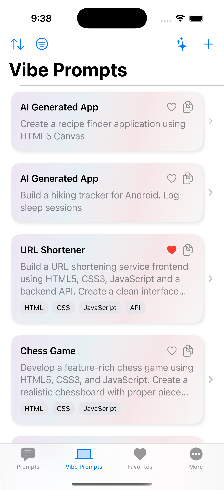

# AI Prompts

A Swift iOS app for managing, browsing, and sharing AI prompts. Inspired by [f/awesome-chatgpt-prompts](https://github.com/f/awesome-chatgpt-prompts), this app offers a curated collection of prompts for ChatGPT, Grok, and other LLM tools.

## Screenshots

<p align="center">
  
  
  
</p>

## Features

- **Curated Prompts**: Browse a collection of high-quality AI prompts, including a special "Vibe Prompts" section for app-specific or mood-based prompts.
- **Favorites**: Mark prompts as favorites for quick access.
- **Prompt Details**: View detailed information for each prompt, including contributor and tech stack.
- **Modern SwiftUI Interface**: Clean, tab-based navigation for Prompts, Vibe Prompts, Favorites, and More.
- **Modular Architecture**: Includes a reusable `MoreApps` module for app recommendations, with localization support.
- **Local Data Management**: Uses GRDB for efficient, local data storage and management.
- **CSV Import**: Prompt and vibe prompt data are loaded from local CSV files for easy updates and contributions.
- **Multilingual Support**: Fully localized in English, Simplified Chinese, and Traditional Chinese.
- **Dark Mode**: Supports system-wide dark mode, with user preference override.
- **Ad Integration**: Integrates Google Mobile Ads with ATT permission handling.
- **App Store Links**: The More tab features other recommended apps with direct App Store links.

## Getting Started

### Prerequisites

- Xcode 14 or later
- Swift 5.7+
- iOS 17.0+

### Installation

1. Clone the repository:
   ```bash
   git clone https://github.com/banghuazhao/ai-prompts.git
   cd ai-prompts
   ```
2. Open `AIPrompts.xcodeproj` in Xcode.
3. Run the project on your simulator or device.

### Project Structure

- `AIPrompts/App/` – App entry point and main views (tab navigation)
- `AIPrompts/Components/` – SwiftUI components (Favorites, Prompts, VibePrompt, More, etc.)
- `AIPrompts/Model/` – Data models (`Prompt`, `VibePrompt`)
- `AIPrompts/Service/` – Data management, CSV loading, and app services
- `AIPrompts/Modules/MoreApps/` – Modular feature for app recommendations (with localization)
- `AIPrompts/Doc/` – CSV files for prompt data
- `AIPrompts/Assets.xcassets/` – App icons and assets

## Data Model Example

```swift
struct VibePrompt: Identifiable, Hashable {
    let id: Int
    var app: String
    var prompt: String
    var contributor: String
    var techstack: String
    var isFavorite: Bool
    // ...
}
```

## Contributing

Contributions are welcome! Please open issues or pull requests for new prompts, features, or bug fixes. To add new prompts, simply update the CSV files in `AIPrompts/Doc/`.

## License

[MIT](LICENSE)

## Author

- [banghuazhao](https://github.com/banghuazhao)

## Inspiration

This project is inspired by [f/awesome-chatgpt-prompts](https://github.com/f/awesome-chatgpt-prompts), a curated collection of useful prompts for ChatGPT and other LLM tools. 